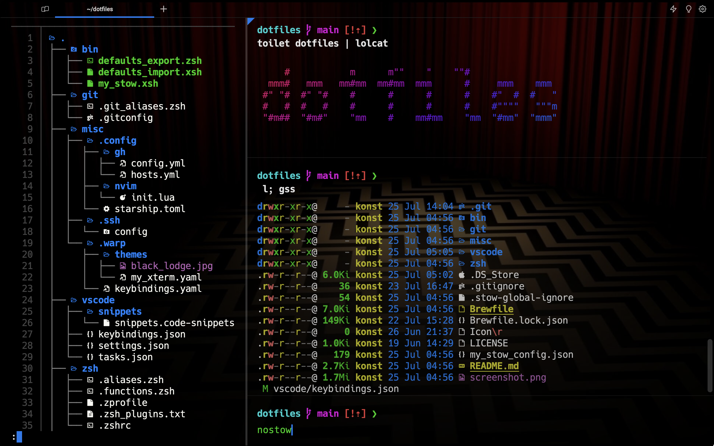

# My Dotfiles

## About

### Built With

| Tool                                                | Description           |
| --------------------------------------------------- | --------------------- |
| [GNU Stow](https://www.gnu.org/software/stow/)      | Symlink farm manager  |
| [Cstow](https://github.com/constkolesnyak/cstow)    | My GNU Stow wrapper   |
| [Homebrew](https://brew.sh/)                        | Package manager       |
| [Mas](https://github.com/mas-cli/mas)               | App Store CLI         |
| [Warp](https://www.warp.dev/)                       | Terminal              |
| [VS Code](https://code.visualstudio.com/)           | Editor                |
| [VSCodeVim](https://github.com/VSCodeVim/Vim)       | Vim emulator          |
| [Neovim](https://neovim.io/)                        | Additional editor     |
| [Packer](https://github.com/wbthomason/packer.nvim) | Neovim plugin manager |
| [Zsh](https://www.zsh.org/)                         | Shell                 |
| [Antidote](https://getantidote.github.io/)          | Zsh plugin manager    |
| [Starship](https://starship.rs/)                    | Prompt                |
| [Defaults](https://macos-defaults.com/)             | macOS settings CLI    |

### How It Works

[Cstow](https://github.com/constkolesnyak/cstow)
passes [dirs and targets](https://www.gnu.org/software/stow/manual/stow.html#Invoking-Stow)
from [cstow.toml](cstow.toml) to GNU Stow.

## Installation

### 1) Preparation

1.  Clone the repo.

        gh repo clone constkolesnyak/dotfiles ~/dotfiles

2.  Source aliases and environment variables.

    > Run `where some_alias` to understand aliases before executing them.

        . ~/dotfiles/zsh/.aliases.zsh ~/dotfiles/zsh/.zvars.env

### 2) Brew

1.  Check what apps are missing.

    > Delete the ones you don't need from `Brewfile`.

        brcheck

2.  Install apps.

        brbundle

### 3) Stow

1.  Symlink `.stow-global-ignore`.

        ln -s ~/dotfiles/.stow-global-ignore ~/.stow-global-ignore

2.  [Install](https://github.com/constkolesnyak/cstow#installation)
    and [configure](https://github.com/constkolesnyak/cstow#configuration)
    Cstow.

3.  Run Cstow in simulation mode.

        nostow

4.  Run Cstow for real.

        ststow

### 3) Finally

- Source `~/.zshrc`.

      reload

### 4) Additionally

- Install apps listed in [some_cli_apps.txt](misc/some_cli_apps.txt).

- [Sync](https://code.visualstudio.com/docs/editor/settings-sync) VS Code UI state.
  Unfortunately, it
  [can't](https://code.visualstudio.com/docs/editor/profiles#_where-is-the-ui-state-globalstatejson-file)
  be version controlled.

- Add SSH keys for
  [GitHub](https://docs.github.com/en/authentication/connecting-to-github-with-ssh/adding-a-new-ssh-key-to-your-github-account)
  and/or
  [GitLab](https://docs.gitlab.com/ee/user/ssh.html#add-an-ssh-key-to-your-gitlab-account)
  to `~/.ssh`.

- Sync macOS settings with `defaults` scripts.

  1.  On Mac-1 with desired settings.

          zsh ~/dotfiles/bin/defaults_export.zsh

  2.  Copy directory with settings from Mac-1 to Mac-2.

  3.  On Mac-2.

          xonsh ~/dotfiles/bin/defaults_import.xsh

## Uninstall

    destow
    /bin/rm -rf ~/dotfiles ~/.stow-global-ignore
